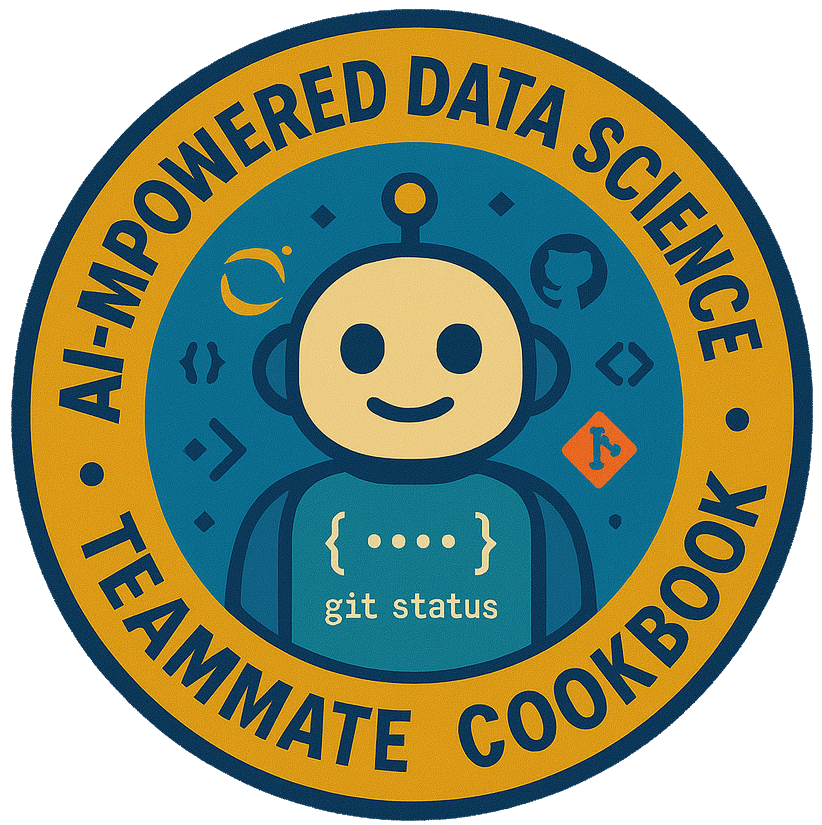

# A Simplified Data Analysis Using an AI Teammate Exploration Cookbook



[](https://github.com/ProjectPythia/cookbook-template/actions/workflows/nightly-build.yaml)
[](https://binder.projectpythia.org/v2/gh/ProjectPythia/cookbook-template/main?labpath=notebooks)
[](https://zenodo.org/badge/latestdoi/475509405)

_See the [Cookbook Contributor's Guide](https://projectpythia.org/cookbook-guide) for step-by-step instructions on how to create your new Cookbook and get it hosted on the [Pythia Cookbook Gallery](https://cookbooks.projectpythia.org)!_

This Project Pythia Cookbook covers ... (replace `...` with the main subject of your cookbook ... e.g., _working with radar data in Python_)

## Enhancing Algorithmic Literacy Among Vulnerable Populations through Geoscience Applications

Imagine a community-based geoscience project where local learners explore biodiversity through a dataset of penguin species.

In the geoscience community, algorithm literacy is more than technical fluency—it’s a pathway to justice. Vulnerable populations often bear the brunt of environmental decisions shaped by opaque data systems. To shift this paradigm, we must equip these communities not only with knowledge, but with agency.

Enter the AI teammate:  not as a distant tool, but as a responsive partner! Through explicit AI prompts, learners can engage in targeted, conversational learning that breaks down complex algorithmic concepts into accessible, actionable insights. These prompts serve as microburst upskilling lessons--short, focused interactions where AI explains cocepts like correlations, classification, and feature importance as plain language.  

Vulnerable populations, often excluded from technical discourse, now gain the tools to explore, question, and interpret data that mirrors real-world ecological systems - tailored to real-world geoscience challenges.

By embedding microburst upskilling into daily workflows and community initiatives, we create rapid, scalable opportunities for learning. These short, focused interactions with AI empower users to ask better questions, challenge assumptions, and co-create solutions. The result? A growing network of algorithm-literate individuals who can actively participate in—and shape—their own liberation.

Let us reimagine algorithm literacy not as a distant goal, but as a daily practice. With AI as a teammate and microburst learning as our method, we can build a geoscience future that is inclusive, transparent, and driven by the voices that matter most.
## Authors

[First Author](https://github.com/first-author1), [Second Author](https://github.com/second-author2), etc. _Acknowledge primary content authors here_

### Contributors

<a href="https://github.com/ProjectPythia/cookbook-template/graphs/contributors">
  
</a>

## Structure

(State one or more sections that will comprise the notebook. E.g., _This cookbook is broken up into two main sections - "Foundations" and "Example Workflows."_ Then, describe each section below.)

### Section 1 ( Replace with the title of this section, e.g. "Foundations" )

(Add content for this section, e.g., "The foundational content includes ... ")

### Section 2 ( Replace with the title of this section, e.g. "Example workflows" )

(Add content for this section, e.g., "Example workflows include ... ")

## Running the Notebooks

You can either run the notebook using [Binder](https://binder.projectpythia.org/) or on your local machine.

### Running on Binder

The simplest way to interact with a Jupyter Notebook is through
[Binder](https://binder.projectpythia.org/), which enables the execution of a
[Jupyter Book](https://jupyterbook.org) in the cloud. The details of how this works are not
important for now. All you need to know is how to launch a Pythia
Cookbooks chapter via Binder. Simply navigate your mouse to
the top right corner of the book chapter you are viewing and click
on the rocket ship icon, (see figure below), and be sure to select
“launch Binder”. After a moment you should be presented with a
notebook that you can interact with. I.e. you’ll be able to execute
and even change the example programs. You’ll see that the code cells
have no output at first, until you execute them by pressing
{kbd}`Shift`\+{kbd}`Enter`. Complete details on how to interact with
a live Jupyter notebook are described in [Getting Started with
Jupyter](https://foundations.projectpythia.org/foundations/getting-started-jupyter).

Note, not all Cookbook chapters are executable. If you do not see
the rocket ship icon, such as on this page, you are not viewing an
executable book chapter.


### Running on Your Own Machine

If you are interested in running this material locally on your computer, you will need to follow this workflow:

(Replace "cookbook-example" with the title of your cookbooks)

1. Clone the `https://github.com/ProjectPythia/cookbook-example` repository:

   ```bash
    git clone https://github.com/ProjectPythia/cookbook-example.git
   ```

1. Move into the `cookbook-example` directory
   ```bash
   cd cookbook-example
   ```
1. Create and activate your conda environment from the `environment.yml` file
   ```bash
   conda env create -f environment.yml
   conda activate cookbook-example
   ```
1. Move into the `notebooks` directory and start up Jupyterlab
   ```bash
   cd notebooks/
   jupyter lab
   ```
